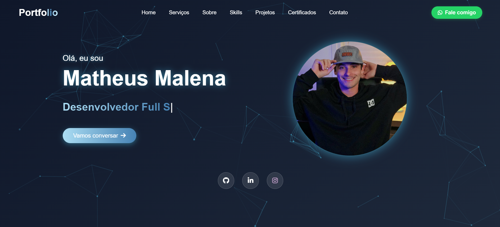

# Meu Portfólio 🤙



<p align="center">
  <a href="#-tecnologias">Tecnologias</a>&nbsp;&nbsp;&nbsp;|&nbsp;&nbsp;&nbsp;
  <a href="#-projeto">Projeto</a>&nbsp;&nbsp;&nbsp;|&nbsp;&nbsp;&nbsp;
  <a href="#-como-executar">Como Executar</a>&nbsp;&nbsp;&nbsp;|&nbsp;&nbsp;&nbsp;
  <a href="#-preview">Preview</a>
</p>

<br>

## 🚀 Tecnologias

Este projeto foi desenvolvido com as seguintes tecnologias:

- Vue 3 (Composition API)
- Vite
- HTML5 e CSS3 moderno
- JavaScript ES6+
- Font Awesome (para ícones)
- AOS (Animate On Scroll - para animações)

## 💻 Projeto

Meu portfólio pessoal desenvolvido para compartilhar minha trajetória na programação, demonstrar minhas habilidades e projetos desenvolvidos. O site apresenta:

- Seção "Sobre mim" com minha jornada
- Habilidades técnicas
- Projetos realizados
- Formas de contato
- Links para minhas redes sociais

## 🛠️ Como Executar

Siga estas instruções para rodar o projeto localmente:

1. **Pré-requisitos**:
   - Node.js (versão 16 ou superior)
   - npm ou yarn

2. **Clone o repositório**:
   ```bash
   git clone https://github.com/seu-usuario/seu-repositorio.git
   cd seu-repositorio
   ```

3. **Instale as dependências**:
   ```bash
   npm install
   # ou
   yarn install
   ```

4. **Execute o servidor de desenvolvimento**:
   ```bash
   npm run dev
   # ou
   yarn dev
   ```

5. **Acesse o projeto**:
   Abra seu navegador em [http://localhost:5173](http://localhost:5173)

6. **Para build de produção**:
   ```bash
   npm run build
   # ou
   yarn build
   ```

## 📝 Licença

Este projeto está sob a licença MIT. Veja o arquivo [LICENSE](LICENSE) para mais detalhes.

---

Feito com ❤️ por [Seu Nome](https://github.com/seu-usuario)